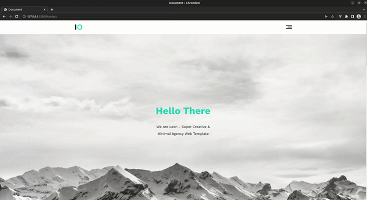

# Agency Website Template



## About The Project

` Simple Agency Website Template. This is the first application in ElZero Frontend course for HTML&CSS`

### Built with

- HTML5
- CSS3

## Getting Started

### Installation

1. Clone the repository

   ```
    git clone https://github.com/Passant-Abdelgalil/Agency_web_template.git
   ```

### Run

1. double click `index.html` to open

## Project Structure

```
.
├── README
├── index.css       # styles
├── index.html      # html code
└── assets
    └── preview.gif

```
